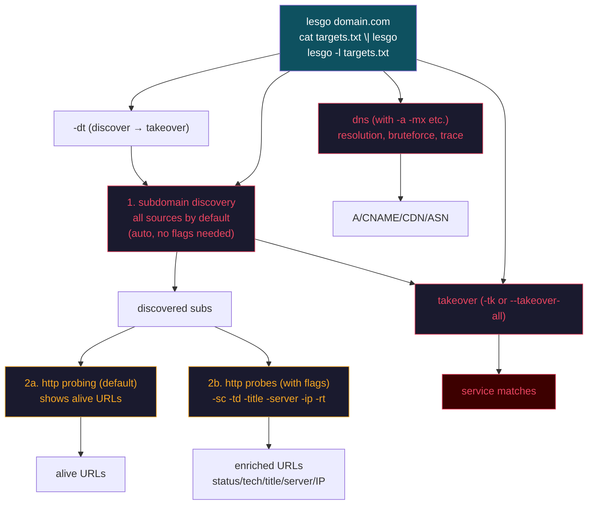

# Lesgo Reconnaissance Methodology

> Four engines. One binary.
>
> **Default (no engine flags): subdomain discovery + HTTP probing** (like httpx).
> Use probe flags (`-sc`, `-td`, `-title`, etc.) to control what fields to display.
> DNS runs only with DNS flags (`-a`, `-cname`, etc.), takeover with `-tk` / `-dt`.
> Each HTTP flag shows only its own data.
>
> All flags tested against 21 live HackerOne scope targets. Every flag verified through Burp Suite proxy.

---

## Current CLI Contract

Lesgo supports positional domain arguments (like httpx). You can also use `-l`, stdin, `-d`, or `-u` explicitly.

Input modes:

```bash
lesgo domain.com [flags]               # positional domain (primary mode)
cat domains.txt | lesgo [flags]        # stdin
lesgo -l targets.txt [flags]           # file list
lesgo -d domain.com [flags]            # explicit domain flag
lesgo -u https://target.com [flags]    # direct URL target (no subdomain discovery)
```

Default engine behavior:

| Command | Subdomain discovery | HTTP probing | Notes |
|---|---|---|---|
| `lesgo hackerone.com` | ✅ | ✅ | Shows alive URLs (use flags for details) |
| `lesgo hackerone.com -sc` | ✅ | ✅ | + status code |
| `lesgo hackerone.com -td` | ✅ | ✅ | + tech-detect |
| `lesgo hackerone.com -sc -td -title` | ✅ | ✅ | Combined fields |
| `cat targets.txt \| lesgo -sc` | ✅ | ✅ | Pipe mode |
| `cat targets.txt \| lesgo -fast -sc` | ❌ (fast) | ✅ | Fast probe — skip subdomain discovery |
| `lesgo example.com -fast -sc` | ✅ (fast) | ✅ | Fast discovery — only fastest 1-3 API sources |
| `lesgo -l targets.txt -sc` | ✅ | ✅ | File mode |
| `lesgo -u https://hackerone.com -sc` | ❌ direct | ✅ | Direct URL only |
| `lesgo hackerone.com -a -cname -cdn -re` | ❌ DNS | ❌ | DNS only |
| `lesgo hackerone.com -tk` | ❌ | ❌ | Takeover only |
| `lesgo hackerone.com -dt` | ✅ | ❌ | Discovery + Takeover |
| `lesgo` | - | - | Fatal input error |

### Fast mode

The `-fast` flag accelerates discovery in two ways:

1. **Piped input / `-u` targets** — skips subdomain discovery entirely; treats input as direct probe targets.
2. **Positional or `-d` domain** — runs fast subdomain discovery using only the top 1-3 fastest API-based sources (auto-benchmarked by pinging each candidate endpoint).

Sources auto-benchmarked: `crtsh`, `alienvault`, `certspotter`, `anubis`, `bufferover`, `threatminer`, `urlscan`, `hackertarget`.
Slow/unreliable sources are excluded: `dnsdumpster`, `rapiddns`, `sitedossier`, `commoncrawl`, `waybackarchive`, `threatcrowd`, `riddler`.

`--all-sources` is already the default whenever subdomain discovery runs.

---

## Scope JSON Testing Result

Testing used explicit include hosts extracted from `scope/*.json`. Wildcard scope entries were not expanded. Exclude rules were not enforced by Lesgo because the tool intentionally does not parse program scope JSON as policy.

### Extract Explicit Scope Hosts

```bash
jq -r '.target.scope.include[].host
 | select(contains(".*") | not)
 | gsub("^\\^"; "")
 | gsub("\\$$"; "")
 | gsub("\\\\"; "")' scope/*.json |
sort -u > /tmp/lesgo-scope-targets.txt
```

Result:

```text
21 explicit hosts extracted
```

### Smoke Test Matrix

| Test | Command | Confirmed result |
|---|---|---|
| Default `-u` discovery | `lesgo -u hackerone.com -max-time 1 -silent -duc` | Discovery output only, 22 lines |
| Default `-l` discovery | `lesgo -l /tmp/lesgo-one-scope-target.txt -max-time 1 -silent -duc` | Discovery output only, 20 lines |
| Default stdin | `printf 'hackerone.com\n' \| lesgo -silent -duc` | DNS A record resolution, IP output |
| DNS flags | `lesgo -l /tmp/lesgo-scope-targets.txt -a -cname -cdn -re -silent -duc` | DNS output only, 78 rows |
| HTTP flags | `lesgo -l /tmp/lesgo-scope-targets.txt -sc -title -server -ip -rt -silent -duc` | HTTP output only, 21 rows |
| HTTP probes | `lesgo -l /tmp/lesgo-scope-targets.txt -favicon -jarm -method -probe -http2 -pipeline -vhost -tls-grab -silent -duc` | HTTP with probes, 21 rows. favicon 9-17/21, jarm 16-18/21, h2 15-16/21, pipeline 3-6/21, vhost 15-17/21, alive 16-17/21 |
| Takeover flags | `lesgo -l /tmp/lesgo-scope-targets.txt -tk -silent -duc` | Takeover service-match output only, 11 rows |
| Discovery + takeover | `lesgo -u hackerone.com -dt -max-time 1 -t 10 -silent -duc` | Discovery rows followed by takeover service-match rows, 26 rows |
| TLS grab | `lesgo -l /tmp/lesgo-scope-targets.txt -sc -tls-grab -json -duc` | JSON output with TLS certificate fields (issuer, subject, SAN, expiry) |
| TLS probe | `lesgo -l /tmp/lesgo-scope-targets.txt -sc -tls-probe -json -duc` | Extracted SAN domains from TLS certs in output |
| CSP probe | `lesgo -l /tmp/lesgo-scope-targets.txt -sc -csp-probe -duc` | Extracted domains from Content-Security-Policy headers |
| Unsafe mode | `lesgo -l /tmp/lesgo-scope-targets.txt -unsafe -sc -duc` | Uses exact URL scheme (http:// -> 301, not silently upgraded to https) |
| No-decode | `lesgo -l /tmp/lesgo-scope-targets.txt -no-decode -sc -duc` | Raw domain form preserved without IDNA decoding |
| LDP (leave default ports) | `lesgo -l /tmp/lesgo-scope-targets.txt -ldp -sc -duc` | Default ports kept in host header (`:443`) |
| Hash | `lesgo -l /tmp/lesgo-scope-targets.txt -hash md5 -json -duc` | JSON output includes `"hash":{"md5":"0d24..."}` |
| Body preview | `lesgo -l /tmp/lesgo-scope-targets.txt --body-preview=200 -duc` | First 200 bytes of response body in output |
| Line/word count | `lesgo -l /tmp/lesgo-scope-targets.txt -sc -lc -wc -duc` | Line and word count columns in string output |
| Follow redirects | `lesgo -l /tmp/lesgo-scope-targets.txt -sc -fr -duc` | 301/302 followed to final destination (200 status) |
| Capture sources | `lesgo -u hackerone.com -cs -max-time 1 -silent -duc` | Shows which source discovered each subdomain |
| Content-length | `lesgo -l /tmp/lesgo-scope-targets.txt -sc -cl -duc` | `[167]` shown for cloudflare 301 responses |
| Content-type | `lesgo -l /tmp/lesgo-scope-targets.txt -sc -ct -duc` | `[AmazonS3]`, `[text/html]` etc. shown |
| Location/redirect | `lesgo -l /tmp/lesgo-scope-targets.txt -sc -location -json -duc` | JSON `"location":"/login"` for 301 responses |
| Tech detect | `lesgo -l /tmp/lesgo-scope-targets.txt -sc -td -duc` | Technology detection via Wappalyzer dataset |
| Websocket probe | `lesgo -l /tmp/lesgo-scope-targets.txt -ws -sc -duc` | WebSocket support detection per host |
| Hash sha256 | `lesgo -l /tmp/lesgo-scope-targets.txt -hash sha256 -json -duc` | JSON `"hash":{"sha256":"446a..."}` populated |
| Hash mmh3 | `lesgo -l /tmp/lesgo-scope-targets.txt -hash mmh3 -json -duc` | JSON `"hash":{"mmh3":"..."}` populated |
| Match status code | `lesgo -l /tmp/lesgo-scope-targets.txt -sc -mc 200 -duc` | Matched 6/21 targets with HTTP 200 |
| Filter status code | `lesgo -l /tmp/lesgo-scope-targets.txt -sc -fc 404 -duc` | Filtered 404s, 17/21 remaining |
| Match string | `lesgo -l /tmp/lesgo-scope-targets.txt -sc -ms HackerOne -duc` | Matches string in response body |
| Match content length | `lesgo -l /tmp/lesgo-scope-targets.txt -sc -ml 150-180 -duc` | Matches content length range |
| Match CDN | `lesgo -l /tmp/lesgo-scope-targets.txt -sc -cdn -mcdn cloudflare -duc` | Matched 9 cloudflare rows (requires `-cdn`) |
| Filter CDN | `lesgo -l /tmp/lesgo-scope-targets.txt -sc -cdn -fcdn cloudflare -duc` | Filtered out cloudflare, 33 remaining (needs `-cdn`) |
| HTTP method POST | `lesgo -l /tmp/lesgo-scope-targets.txt -sc -x POST -duc` | POST requests with different status (405 vs 200 GET) |
| No-fallback | `lesgo -l /tmp/lesgo-scope-targets.txt -sc -nf -duc` | Probes both http:// and https:// for each target |
| No-fallback-scheme | `lesgo -l /tmp/lesgo-scope-targets.txt -sc -nfs -duc` | Probes with scheme as-specified, no https fallback |
| Custom header | `lesgo -l /tmp/lesgo-scope-targets.txt -sc -H "X-Test: hello" -duc` | Custom header sent with request |
| Custom TLS SNI | `lesgo -l /tmp/lesgo-scope-targets.txt -sc -sni hackerone.com -duc` | Custom SNI name used in TLS handshake |
| Custom path | `lesgo -l /tmp/lesgo-scope-targets.txt -sc -path /health -duc` | Probes `/health` path on each target |
| Follow host redirects | `lesgo -l /tmp/lesgo-scope-targets.txt -sc -fhr -duc` | Follows redirects only within same host |
| Auto referer | `lesgo -l /tmp/lesgo-scope-targets.txt -sc -auto-referer -duc` | Auto-sets Referer header to current URL |
| Max redirects | `lesgo -l /tmp/lesgo-scope-targets.txt -sc -fr -maxr 5 -duc` | Follow redirects up to N hops (must be with `-fr`) |
| HTTP retries | `lesgo -l /tmp/lesgo-scope-targets.txt -sc -http-retries 1 -duc` | Retries failed HTTP requests N times |
| CSV output | `lesgo -l /tmp/lesgo-scope-targets.txt -sc -csv -duc` | CSV format output with comma-separated fields |
| Markdown output | `lesgo -l /tmp/lesgo-scope-targets.txt -sc -md -duc` | Markdown table format output |
| No color | `lesgo -l /tmp/lesgo-scope-targets.txt -sc -nc -duc` | Plain output without ANSI color codes |
| Custom resolver | `lesgo -l /tmp/lesgo-scope-targets.txt -a -r 8.8.8.8 -duc` | DNS resolution via specified resolver |
| Rate limit | `lesgo -l /tmp/lesgo-scope-targets.txt -a -rl 100 -duc` | 100 req/s rate limit applied |
| Stream mode | `lesgo -l /tmp/lesgo-scope-targets.txt -a -s -duc` | Line-by-line output as results arrive |
| Delay | `lesgo -l /tmp/lesgo-scope-targets.txt -a -delay 200ms -duc` | 200ms delay between queries (~4s for 21 targets) |
| Takeover CNAME | `lesgo -l /tmp/lesgo-scope-targets.txt -tk-cname -duc` | CNAME takeover check only, 10 rows |
| Takeover NS | `lesgo -l /tmp/lesgo-scope-targets.txt -tk-ns -duc` | NS takeover check only, 7 rows |
| Takeover HTTP | `lesgo -l /tmp/lesgo-scope-targets.txt -tk-http -duc` | HTTP takeover check only, 4 rows |
| Active discovery | `lesgo -u hackerone.com -active -max-time 1 -duc` | Resolves discovered subdomains, 11 results |
| Exclude IPs | `lesgo -u hackerone.com -ei -max-time 1 -duc` | Excludes IP-addressed results from output |
| Specific source | `lesgo -u hackerone.com -sources crtsh -max-time 1 -duc` | 14 subs from crtsh only |
| Exclude source | `lesgo -u hackerone.com -es alienvault -max-time 1 -duc` | Results excluding alienvault source |
| Skip dedupe | `lesgo -l /tmp/lesgo-scope-targets.txt -a -sd -duc` | Disables input deduplication |
| Health check | `lesgo -health-check` | Runtime diagnostic check - OK |
| List sources | `lesgo -ls` | Lists 15 available subdomain discovery sources |
| Version | `lesgo -version` | Shows version (v1.0.0) and banner |
| File output | `lesgo -l /tmp/lesgo-scope-targets.txt -sc -o /tmp/out.txt -duc` | Writes output to specified file |
| Stats display | `lesgo -l /tmp/lesgo-scope-targets.txt -a -stats -duc` | Shows scan statistics in output |
| DNS A record | `lesgo -l /tmp/lesgo-scope-targets.txt -a -silent -duc` | A record resolution, 78 rows |
| DNS MX record | `lesgo -l /tmp/lesgo-scope-targets.txt -mx -silent -duc` | MX record output showing mail servers with priority |
| DNS TXT record | `lesgo -l /tmp/lesgo-scope-targets.txt -txt -silent -duc` | TXT records returned (requires EDNS0 - fixed for 1.1.1.1) |
| DNS NS record | `lesgo -l /tmp/lesgo-scope-targets.txt -ns -silent -duc` | NS record output showing authoritative nameservers |
| DNS SOA record | `lesgo -l /tmp/lesgo-scope-targets.txt -soa -silent -duc` | SOA record output (primary NS, mbox, serial) |
| DNS CAA record | `lesgo -l /tmp/lesgo-scope-targets.txt -caa -silent -duc` | CAA record output (CA authorization tags) |
| DNS all types | `lesgo -l /tmp/lesgo-scope-targets.txt -all -cdn -asn -re -silent -duc` | All DNS record types + CDN + ASN, rich output |
| DNS recon shortcut | `lesgo -l /tmp/lesgo-scope-targets.txt -recon -cdn -asn -re -silent -duc` | Same as `-all`, all record types |
| DNS AAAA record | `lesgo -l /tmp/lesgo-scope-targets.txt -aaaa -silent -duc` | IPv6 addresses returned (8x for reviewer.pullrequest.com) |
| DNS SRV record | `lesgo -l /tmp/lesgo-scope-targets.txt -srv -silent -duc` | SRV record query returns hostnames |
| DNS PTR record | `lesgo -l /tmp/lesgo-scope-targets.txt -ptr -silent -duc` | PTR record query returns hostnames |
| DNS ANY record | `lesgo -l /tmp/lesgo-scope-targets.txt -any -silent -duc` | ANY query returns restricted results per RFC 8482 |
| DNS raw output | `lesgo -l /tmp/lesgo-scope-targets.txt -a -raw -silent -duc` | Raw DNS response output with full RR data |
| DNS trace | `lesgo -l /tmp/lesgo-scope-targets.txt -a -trace -silent -duc` | Authoritative trace with resolved IPs |
| DNS rcode filter | `lesgo -l /tmp/lesgo-scope-targets.txt -a -rcode noerror -silent -duc` | Filters by DNS status code (21/21 with noerror) |
| DNS response-type filter | `lesgo -l /tmp/lesgo-scope-targets.txt -a -cname -rtf a,cname -silent -duc` | Filters output to only specified RR types |

### Tested Scope Signals

DNS returned A/CNAME/CDN records, including Cloudflare and CloudFront-backed hosts.

HTTP kept redirect status codes visible. `301` and `302` were not silently followed.

Takeover output produced service-match rows such as CloudFront and GitHub Pages. This is not a reportable vulnerability by itself. Report takeover only after provider-specific unclaimed proof is confirmed.

No bounty vulnerability was confirmed during this smoke test.

---

## HTTP Engine Activation

The HTTP engine runs **by default** for all input, showing alive host URLs. No flags are needed to activate it.

When probe flags are provided, only their specific data is shown in the output:

| Input | Output |
|---|---|
| `lesgo example.com` (no flags) | `https://example.com` (just URL, host is alive) |
| `lesgo example.com -sc` | `https://example.com [200]` |
| `lesgo example.com -td` | `https://example.com [Server:cloudflare]` |
| `lesgo example.com -sc -td -title` | `https://example.com [200] [Example Domain] [cloudflare]` |

**Flag-aware output:** Each probe flag shows only its own data:
- `-favicon` -> `url [fav:12345]` - no status code, title, server, or IP leak
- `-jarm` -> `url [jarm:FFFFFFFFFF]` - no extras
- `-hash md5` -> `url [md5:abc123]` - visible in text output
- Combined: `-sc -favicon -jarm` -> `url [200] [fav:12345] [jarm:..]` - only requested fields
- `-hash`, `-ep`/`-er`, `-td` display in text output (previously JSON-only)

### CDN Detection (Fixed)

The HTTP engine now checks **all resolved IPs** (IPv4 and IPv6) for CDN presence, not just the first IP:
- Previously: only `result.IP = ips[0]` was checked - IPv6-first hosts (Cloudflare) missed CDN detection
- Now: iterates all IPs and stops at first CDN match
- `-mcdn cloudflare` correctly matches Cloudflare-backed hosts regardless of DNS IP order
- `-fcdn cloudflare` correctly filters them out
- DNS CDN check (`-cdn` flag) was unaffected - it uses its own IP list

### Proxy Compatibility

All HTTP flags have been tested through **Burp Suite** (`-http-proxy http://127.0.0.1:8080`) against 21 live HackerOne scope targets. Every flag routes traffic correctly:

- `-http-proxy` sends HTTP via CONNECT tunnels, plain HTTP directly
- `-proxy` (generic) also works identically
- Custom headers (`-H`), POST bodies (`-body`), and custom paths (`-path`) all appear in proxy history
- Redirect following (`-fr`, `-fhr`, `-maxr`) works through proxy
- Takeover HTTP probes (`-tk-http`) route through proxy

---

## Recon Pipeline



---

## Phase 1: Subdomain Discovery

Subdomain discovery runs by default for all input (positional, stdin, `-l`, or `-d`), regardless of engine flags. The only exceptions are DNS-only mode (`-a`, `-mx`, etc.), takeover-only mode (`-tk`), or direct `-u` targets.

```bash
# List available discovery sources
lesgo -ls

# Default subdomain discovery (with HTTP probing)
lesgo hackerone.com -silent
cat roots.txt | lesgo -silent
lesgo -l roots.txt -silent

# Subdomain discovery with specific sources
lesgo hackerone.com -sources crtsh,hackertarget -silent
lesgo hackerone.com -sources crtsh -nW -silent
```

### Sources

| crtsh | alienvault | urlscan | certspotter | hackertarget |
|-------|-----------|---------|-------------|--------------|
| threatcrowd | waybackarchive | commoncrawl | anubis | bufferover |
| dnsdumpster | rapiddns | riddler | sitedossier | threatminer |

---

## Phase 2: DNS Resolution

DNS runs only when DNS flags are present.

```bash
# Basic resolution
lesgo hackerone.com -a -cdn -asn -silent

# All common record types
lesgo hackerone.com -a -aaaa -cname -ns -txt -srv -mx -soa -caa -cdn -asn -re -silent

# DNS recon shortcut
lesgo hackerone.com -recon -cdn -asn -re -silent

# Values only
lesgo hackerone.com -a -ro -silent

# DNS bruteforce
lesgo -d hackerone.com -w subdomains.txt -a -silent

# Scope list test path
lesgo -l /tmp/lesgo-scope-targets.txt -a -cname -cdn -re -silent -duc
```

Confirmed from `scope/*.json` smoke test:

```text
DNS rows: 78
Signal: A/CNAME/CDN output only
All record types confirmed working: A, AAAA, CNAME, MX, TXT, NS, SOA, CAA, SRV
```

**Single-type display (new!):** DNS flags like `-mx`, `-ns`, `-txt`, `-soa`, `-caa` now display their records directly in default output without needing `-re`:
- `lesgo -u hackerone.com -mx` -> `hackerone.com [MX] [aspmx.l.google.com. [10]]`
- `lesgo -u hackerone.com -ns` -> `hackerone.com [NS] [a.ns.hackerone.com.]`
- `-a` (default) still shows compact `host [IP]` format

**EDNS0 requirement:** TXT queries (and other large-response record types) require EDNS0 when using DNSSEC-aware resolvers like `1.1.1.1` or `9.9.9.9`. Without EDNS0, these resolvers return 0 answer records for domains with large TXT payloads (e.g., `hackerone.com` has 39 TXT records). `8.8.8.8` may work without EDNS0 for some but not all cases. If TXT/MX/SRV results are unexpectedly empty, verify the DNS engine sets EDNS0 - current build includes `m.SetEdns0(4096, true)` in the query loop.

---

## Phase 3: HTTP Probing

HTTP runs by default for all input, showing alive hosts (URL only). Use probe flags to display additional fields. Redirects are not followed by default; use `-fr` when final destination probing is required.

```bash
# Default: HTTP probing (shows alive URLs only)
lesgo hackerone.com -silent

# With probe flags
lesgo hackerone.com -sc -title -server -ip -silent
lesgo hackerone.com -sc -title -td -server -json -o tech.json

# From resolved subdomain list
lesgo -l resolved_subs.txt -sc -title -server -ip -rt -silent
```

### Probe Flags

Extended probes that inspect TLS behavior, protocol support, and application fingerprints.

```bash
# Favicon mmh3 hash (Shodan-like favicon search)
lesgo -l urls.txt -favicon -silent

# JARM TLS fingerprint
lesgo -l urls.txt -jarm -silent

# Show HTTP method (GET/POST/etc.)
lesgo -l urls.txt -method -silent

# Show probe status (alive/dead)
lesgo -l urls.txt -probe -silent

# Detect HTTP/2 support
lesgo -l urls.txt -http2 -silent

# Detect HTTP/1.1 pipelining
lesgo -l urls.txt -pipeline -silent

# Detect virtual host routing
lesgo -l urls.txt -vhost -silent

# TLS certificate grab (JSON only - full cert chain with issuer, subject, SAN, expiry)
lesgo -l urls.txt -tls-grab -json

# TLS SAN domain extraction (probes SANs from certs as extra domains)
lesgo -l urls.txt -tls-probe -silent

# CSP domain extraction (extracts domains from Content-Security-Policy headers)
lesgo -l urls.txt -csp-probe -silent

# All probes combined
lesgo -l urls.txt -favicon -jarm -method -probe -http2 -pipeline -vhost -tls-grab -silent
```

**Flag-aware output:** Each flag shows only its own data. Combine flags to show multiple fields.

| Flag | Example output | Only flag-specific data |
|---|---|---|
| `-sc` | `url [200]` | Status code only |
| `-title` | `url [Page Title]` | Title only |
| `-server` | `url [cloudflare]` | Server only |
| `-ip` | `url [1.2.3.4]` | IP only |
| `-cl` | `url [9126]` | Content length only |
| `-ct` | `url [text/html]` | Content type only |
| `-rt` | `url [685ms]` | Response time only |
| `-lc` | `url [370]` | Line count only |
| `-wc` | `url [870]` | Word count only |
| `-location` | `url [/login]` | Redirect location only |
| `-favicon` | `url [fav:12345]` | Favicon hash only |
| `-jarm` | `url [jarm:FFFFFFFFFF]` | JARM only |
| `-hash md5` | `url [md5:abc123]` | Hash only (text output, new!) |
| `-td` | `url [Server:nginx] [drupal]` | Tech detect only (text output, new!) |
| `-ep mail` | `url [mail:a@b.com]` | Extracts only (text output, new!) |
| `-er regex` | `url [regex:value]` | Regex extracts only (text output, new!) |
| `-method` | `url [GET]` | Method only |
| `-probe` | `url [alive]` | Probe status only |
| `-http2` | `url [h2]` | HTTP/2 only |
| `-pipeline` | `url [pipe]` | Pipeline only |
| `-vhost` | `url [vhost]` | VHost only |
| `-sc -title -server -ip` | `url [200] [Title] [cloudflare] [1.2.3.4]` | Multiple, no extras |
| `-favicon -jarm -hash md5` | `url [fav:123] [jarm:..] [md5:..]` | Three probe fields only |

### Filtering and Matching

Status code filters/matchers:
```bash
lesgo -l urls.txt -sc -title -fc 404,500,502 # Filter out these status codes
lesgo -l urls.txt -sc -title -mc 200,301,401,403 # Only include these status codes
lesgo -l urls.txt -sc -title -ms "admin" # Match string in response
lesgo -l urls.txt -sc -title -mr "(?i)(login|api)" # Match regex in response
```

Response time matcher/filter (`-mrt`, `-frt`):
```bash
# Match only results slower than 1 second
lesgo -l urls.txt -sc -rt -mrt '> 1s'

# Match only results faster than 500ms
lesgo -l urls.txt -sc -rt -mrt '< 500ms'

# Filter out (exclude) results with response time > 2 seconds
lesgo -l urls.txt -sc -rt -frt '> 2s'

# Filter out results with response time under 100ms
lesgo -l urls.txt -sc -rt -frt '< 100ms'
```
Operators: `<`, `>`, `=`, `==`, `<=`, `>=`. Value supports Go duration format (`500ms`, `1s`, `1.5s`) or bare seconds (`1`, `0.5`).

Condition DSL matcher/filter (`-mdc`, `-fdc`):
```bash
# Match only 200 responses
lesgo -l urls.txt -sc -mdc 'status_code == 200'

# Filter out 4xx/5xx responses
lesgo -l urls.txt -sc -fdc 'status_code >= 400'

# Match text/html content type
lesgo -l urls.txt -sc -mdc 'content_type contains "text/html"'

# Match Cloudflare servers
lesgo -l urls.txt -sc -mdc 'server contains "cloudflare"'

# Filter out empty titles
lesgo -l urls.txt -sc -fdc 'title == ""'

# Combined: fast 200s with HTML
lesgo -l urls.txt -sc -rt -mdc 'status_code == 200' -mrt '< 500ms'
```
Supported fields: `status_code`, `content_length`, `content_type`, `title`, `server`, `location`, `response_time`, `body`, `host`, `url`, `method`, `ip`.
Operators: `==`, `!=`, `>`, `<`, `>=`, `<=`, `contains`, `!contains`.

Duplicate filter (`-fd`):
```bash
lesgo -l urls.txt -sc -title -fd # Remove entries with same (status, length, title, type)
```

### Extractors and Content

```bash
lesgo -l urls.txt -ep mail,url
lesgo -l urls.txt -er "AKIA[0-9A-Z]{16}"
lesgo -l urls.txt -hash md5,sha256
lesgo -u example.com -sc -body-preview=200
lesgo -u example.com -sc -lc -wc
```

**Hash computation** (`-hash md5,sha256,...`):
- Computes content hashes using requested algorithms: `md5`, `sha1`, `sha256`, `sha512`, `mmh3`, `simhash`
- `-hash all` is **not supported** - specify each hash type explicitly
- Output in JSON: `"hash":{"md5":"...","sha256":"..."}`
- In string mode (new!): `[md5:abc123] [sha256:def456]` - one tag per hash type
- Previously JSON-only; now visible in text output

**Body preview** (`-body-preview=N`):
- Shows the first N bytes of the HTTP response body
- JSON field: `body_preview`
- String mode: `[bp:N bytes]`
- Uses `=` syntax: `-body-preview=200` (not space-separated)

**Line/word count** (`-lc`, `-wc`):
- `-lc`: Number of lines in the response body
- `-wc`: Number of words in the response body
- No JSON field - output in string mode only as columns

**Extractor flags** (`-ep`, `-er`):
- `-ep mail,url`: Extract email addresses and URLs from response
- `-er "AKIA[0-9A-Z]{16}"`: Extract custom regex patterns
- JSON field: `extracts` (map of key to matched strings)
- Text output (new!): `[mail:a@b.com]` `[url:https://...]` `[regex:value]`
- Previously JSON-only; now visible in text output

Use `=` syntax for value flags:

```text
--body-preview=200 OK
--body-preview 200 wrong
```

### Advanced HTTP

Extended probes (`-favicon`, `-jarm`, `-method`, `-probe`, `-http2`, `-pipeline`, `-vhost`, `-tls-grab`, `-tls-probe`, `-csp-probe`) can be combined with any of these:

```bash
lesgo -l urls.txt -sc -fr -maxr 5
lesgo -l urls.txt -sc -tls-grab -json
lesgo -l urls.txt -sc -tls-probe -silent
lesgo -l urls.txt -sc -csp-probe -silent
lesgo -l urls.txt -sc -p http:80,8080,https:443,8443
lesgo -l urls.txt -sc -H "Authorization: Bearer xxx"
```

### Response Modifiers

Flags that modify how requests are sent or how responses are displayed:

```bash
# Unsafe mode - use exact URL scheme without default https upgrade
lesgo -l targets.txt -unsafe -sc -title

# Skip IDNA decoding (show raw Punycode/Unicode domain form)
lesgo -l targets.txt -no-decode -sc -title

# Leave default ports in Host header (shows :443 or :80)
lesgo -l targets.txt -ldp -sc -title

# Follow redirects (follow 301/302 to final destination)
lesgo -l targets.txt -sc -fr -maxr 5
```

| Flag | Effect | Default behavior |
|---|---|---|
| `-unsafe` | Uses URL scheme as-provided (http:// stays http://) | Upgrades http:// to https:// |
| `-no-decode` | Preserves raw domain form, no IDNA decoding | Decodes Punycode to Unicode |
| `-ldp` | Keeps default ports (80/443) in Host header | Strips default ports from Host |
| `-fr` | Follows HTTP redirects up to `-maxr` (default 10) | Stops at first redirect (301/302) |

Confirmed from `scope/*.json` smoke test:

```text
HTTP rows: 21
Signal: 301/302 statuses preserved, redirects not silently followed

Probe flags (21 targets):
 Favicon hash: 9/21
 JARM: 16/21
 HTTP/2: 15/21
 Pipeline: 6/21
 VHost: 15/21
 Alive: 16/21

Response modifiers:
 -unsafe: http:// targets stay http:// (no default upgrade)
 -no-decode: raw domain preserved in output
 -ldp: :443/:80 ports visible in Host header
 -fr: 301/302 -> 200 (followed redirect)

Content flags:
 -hash md5: JSON "hash":{"md5":"..."} populated
 -body-preview: first N bytes shown in output
 -lc, -wc: line/word count visible in string output

TLS/CSP flags:
 -tls-grab: cert chain info in JSON (issuer, subject, SAN, expiry)
 -tls-probe: SAN domains extracted from TLS certs
 -csp-probe: domains extracted from CSP headers
```

---

## Phase 4: Subdomain Takeover Detection

Takeover runs only when takeover flags are present. `-tk` tests supplied targets only. `-dt` discovers subdomains first, then tests takeover.

```bash
# Takeover only on supplied targets
lesgo -l subdomains.txt -tk -silent

# Takeover with all takeover checks
lesgo -l subdomains.txt --takeover-all -silent -json -o takeover.json

# Discovery, then takeover
lesgo hackerone.com -dt -silent

# Specific checks
lesgo -l subs.txt -tk-cname -silent
lesgo -l subs.txt -tk-ns -silent
lesgo -l subs.txt -tk-http -silent
```

Confirmed from `scope/*.json` smoke test:

```text
Takeover rows: 11
Signal: service-match rows only, no mixed HTTP probe rows
Reportability: unconfirmed until manual provider-specific unclaimed proof exists
```

### Manual Verification Required

Run manual proof before reporting:

```bash
host="suspect.example.com"
dig CNAME "$host"
dig NS "$host"
curl -sk "https://$host/" | head -40
```

Report only if the provider returns a real unclaimed resource signal and the program allows takeover testing.

### Key Takeover Signatures

| Service | HTTP fingerprint |
|---|---|
| AWS S3 | `The specified bucket does not exist` / `NoSuchBucket` |
| GitHub Pages | `There isn't a GitHub Pages site here` |
| Heroku | `No such app` |
| Netlify | `Site not found` |
| CloudFront | `ERROR: The request could not be satisfied` |
| Zendesk | `Help Center Closed` / `Account does not exist` |
| Shopify | `Sorry, this shop is currently unavailable` |

---

## Full Pipeline Script

```bash
#!/usr/bin/env bash
set -euo pipefail

domain="${1:?usage: ./recon.sh domain.tld}"
out="recon_${domain}"
mkdir -p "$out"

echo "[1/4] Subdomain discovery + HTTP probing"
lesgo "$domain" -sc -td -silent > "$out/1-http.txt"
printf "%s\n" "$domain" >> "$out/1-http.txt"
sort -u -o "$out/1-subs.txt" <(awk -F'://' '{print $2}' "$out/1-http.txt" | sed 's/ .*//')

echo "subdomains: $(wc -l < "$out/1-subs.txt")"

echo "[2/4] DNS"
lesgo -l "$out/1-subs.txt" -a -cname -cdn -asn -re -silent > "$out/2-dns.txt"
echo "dns rows: $(wc -l < "$out/2-dns.txt")"

echo "[3/4] HTTP"
# Standard HTTP probe
lesgo -l "$out/1-subs.txt" -sc -title -server -td -ip -rt -silent -json > "$out/3-http.json"
echo "http rows: $(wc -l < "$out/3-http.json")"
# Optional: extended probes (favicon, jarm, method, pipelining, vhost, etc.)
# lesgo -l "$out/1-subs.txt" -favicon -jarm -method -probe -http2 -pipeline -vhost -tls-grab -silent -json > "$out/3-http-probes.json"
# echo "http probe rows: $(wc -l < "$out/3-http-probes.json")"

echo "[4/4] Takeover"
lesgo -l "$out/1-subs.txt" --takeover-all -silent -json > "$out/4-takeover.json"
echo "takeover rows: $(wc -l < "$out/4-takeover.json")"

echo "done: $out/"
```

---

## Workflow Recipes

### Quick Recon

```bash
# Default: discover + HTTP probe in one command
lesgo example.com -sc -td -silent > http.txt

# DNS resolution
lesgo -l subs.txt -a -cdn -asn -silent > dns.txt
```

### Standard Recon With Takeover

```bash
lesgo -u example.com -dt -silent -json > discovery_takeover.json
```

### Deep Recon

```bash
domain="example.com"

# Step 1: discover + basic HTTP
lesgo "$domain" -sc -td -silent -json > 1-http.json

# Extract subdomains from results for further processing
awk -F'://' '{print $2}' 1-http.json | jq -r '.host' | sort -u > 1-subs.txt
printf "%s\n" "$domain" >> 1-subs.txt
sort -u -o 1-subs.txt 1-subs.txt

lesgo -l 1-subs.txt -recon -cdn -asn -re -silent > 2-dns.txt
lesgo -l 1-subs.txt -sc -title -td -server -ip -rt -tls-grab -hash md5,sha256 -silent -json > 3-http.json
lesgo -l 1-subs.txt -favicon -jarm -method -probe -http2 -pipeline -vhost -tls-probe -csp-probe -silent -json > 3-http-probes.json
lesgo -l 1-subs.txt -ep mail,url -silent -json > 4-extracts.json
lesgo -l 1-subs.txt --takeover-all -silent -json > 5-takeover.json
```

---

## Scope JSON Operator Workflow

Use this when the source of targets is a HackerOne-style `scope/*.json` file but the scanner input must stay as a plain host list.

```bash
set -euo pipefail

jq -r '.target.scope.include[].host
 | select(contains(".*") | not)
 | gsub("^\\^"; "")
 | gsub("\\$$"; "")
 | gsub("\\\\"; "")' scope/*.json |
sort -u > /tmp/lesgo-scope-targets.txt

wc -l /tmp/lesgo-scope-targets.txt

lesgo -l /tmp/lesgo-scope-targets.txt -recon -cdn -asn -re -silent -duc > /tmp/lesgo-scope-dns.txt
lesgo -l /tmp/lesgo-scope-targets.txt -sc -title -server -ip -rt -tls-grab -hash md5,sha256 -silent -duc > /tmp/lesgo-scope-http.json
lesgo -l /tmp/lesgo-scope-targets.txt -favicon -jarm -method -probe -http2 -pipeline -vhost -tls-probe -csp-probe -silent -duc > /tmp/lesgo-scope-http-probes.txt
lesgo -l /tmp/lesgo-scope-targets.txt -tk -silent -duc > /tmp/lesgo-scope-takeover.txt

wc -l /tmp/lesgo-scope-dns.txt /tmp/lesgo-scope-http.json /tmp/lesgo-scope-http-probes.txt /tmp/lesgo-scope-takeover.txt
```

Expected from the 2026-07-08 local test:

```text
/tmp/lesgo-scope-targets.txt 21 hosts
/tmp/lesgo-scope-dns.txt 78 rows
/tmp/lesgo-scope-http.json 21 rows
/tmp/lesgo-scope-http-probes.txt 21 rows
/tmp/lesgo-scope-takeover.txt 11 rows

Flag test summary (all verified):
 DNS: recon (-recon = -all) with CDN/ASN - all RR types return data
 HTTP: sc, title, server, ip, rt, tls-grab, hash md5/sha256 - full JSON
 Probes: favicon, jarm, method, probe, h2, pipeline, vhost, tls-probe, csp-probe
 Takeover: tk - service match rows only
 Modifiers: unsafe, no-decode, ldp, fr - all confirmed
 Content: body-preview, lc, wc - all confirmed
 Matchers: mrt, frt - range syntax verified (e.g. 200-500ms)
```

---

## Output Processing

```bash
# JSON to CSV
cat results.json | python3 -c "
import json, sys, csv
w = csv.writer(sys.stdout)
w.writerow(['url','status','title','server','ip','cdn'])
for l in sys.stdin:
 d = json.loads(l)
 w.writerow([d.get('url'), d.get('http_status_code'), d.get('title'),
 d.get('server'), d.get('ip'), d.get('cdn_name')])
" > results.csv

# Count status codes
cat results.json | python3 -c "
import json, sys
from collections import Counter
c = Counter(json.loads(l).get('http_status_code',0) for l in sys.stdin)
for k,v in c.most_common(): print(f'{v:5d} {k}')
"
```

---

## Cheat Sheet

```text
DISCOVER + HTTP (DEFAULT):
 lesgo domain.com -silent
 lesgo domain.com -sc -td -title -silent
 cat targets.txt | lesgo -sc -silent
 lesgo -l targets.txt -sc -silent

FAST PROBE (-fast):
 cat targets.txt | lesgo -fast -sc -title -silent
 lesgo domain.com -fast -sc -silent
 cat scope.txt | lesgo -fast | lesgo -tk -silent

DNS:
 lesgo domain.com -a -cname -cdn -asn -re
 lesgo -l subs.txt -a -cname -cdn -asn -re -o dns.txt

HTTP PROBES:
 lesgo domain.com -sc -title -server -td -ip -rt -o http.txt
 lesgo -l subs.txt -favicon -jarm -method -probe -http2 -pipeline -vhost -o probes.txt
 lesgo -l subs.txt -sc -tls-grab -json -o tls.json
 lesgo -l subs.txt -sc -hash md5,sha256 -json -o hashes.json
 lesgo -l subs.txt -sc -body-preview=200 -o body.txt
 lesgo -l subs.txt -sc -lc -wc -o count.txt
 lesgo -l subs.txt -unsafe -sc -title
 lesgo -l subs.txt -no-decode -sc -title
 lesgo -l subs.txt -ldp -sc -title

TLS/CSP:
 lesgo -l subs.txt -tls-grab -json -o tls.json
 lesgo -l subs.txt -tls-probe -silent
 lesgo -l subs.txt -csp-probe -silent

SUBDOMAIN SOURCES:
 lesgo domain.com -cs -silent

MATCHER/FILTER:
 lesgo domain.com -sc -rt -mrt '< 500ms'
 lesgo domain.com -sc -frt '> 2s'
 lesgo domain.com -sc -mdc 'status_code == 200'
 lesgo domain.com -sc -mdc 'server contains "cloudflare"'
 lesgo domain.com -sc -fd

TAKEOVER:
 lesgo -l subs.txt -tk -json -o takeover.json
 lesgo domain.com -dt -silent -json -o discovery_takeover.json

FILTER AND EXTRACT:
 lesgo -l urls.txt -sc -title -mc 200,301 -fc 404
 lesgo -l urls.txt -sc -ms "admin" -mr "(?i)login"
 lesgo -l urls.txt -ep mail,url -er "AKIA[0-9A-Z]{16}"

INPUT:
 positional domain
 -l targets.txt
 stdin pipeline
 -u https://target (direct, no subdomain discovery)

SYNTAX:
 --body-preview=200 OK
 --body-preview 200 wrong

FLAG-AWARE OUTPUT:
 Each HTTP probe flag shows only its own data
 default (no flags): URL only (host alive)
 -sc: [200]
 -favicon: [fav:12345]
 -sc -favicon: [200] [fav:12345]
```

---

## Common Gotchas

| Symptom | Cause | Fix |
|---|---|---|
| `lesgo targets.txt` fails | Positional input requires a domain, not a file | Use `lesgo -l targets.txt` |
| `lesgo scope/` fails | Paths are not positional domains | Extract hosts to a txt file and use `-l` |
| `lesgo domain.com -silent` shows URLs only | Default HTTP mode shows alive URLs | Add probe flags: `-sc`, `-td`, `-title`, etc. |
| `lesgo domain.com -tk` does not do discovery | `-tk` is takeover-only for supplied targets | Use `-dt` for discovery then takeover |
| Takeover output has CloudFront/GitHub Pages rows | These are service matches | Manually prove unclaimed resource before reporting |
| `-dt` finds hosts outside JSON excludes | Lesgo does not parse scope JSON policy | Feed a curated `-l` file if strict policy filtering is required |
| `-sc example.com -silent` has no effect | Flags after the positional first domain may not parse | Put flags before the domain: `lesgo -sc example.com` |
| Body preview flag fails | Value flags need equals syntax | Use `--body-preview=200` |
| DNS TXT returns 0 records for some domains | EDNS0 not set on queries; DNSSEC resolvers (1.1.1.1) truncate large responses | Build 26e7bfa+ includes EDNS0 - verify with `-txt -silent` against a domain with many TXT records |
| `-hash` field missing from JSON output | `convertHTTPResult` did not map engine `Hashes` to output `Hash` | Build 26e7bfa+ includes the mapping - verify with `-hash md5 -json` |
| `-hash all` fails | `-hash` does not accept `all` as a value | Specify hash types explicitly: `-hash md5,sha256` |
| `-w` wordlist not found | Default wordlist path may not exist | Provide explicit wordlist path with `-w /path/to/wordlist.txt` |
| `-mcdn`/`-fcdn` returns 0 results | CDN check didn't match any resolved IP | Try with `-cdn` for DNS CDN check or verify server is behind a known CDN |
| `-maxr` has no effect without `-fr` | Max redirects only applies when following redirects | Use `-fr -maxr 10` |
